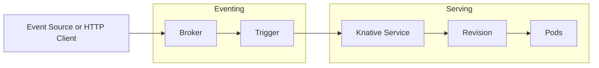

# Knative

Knative adds serverless capabilities on top of Kubernetes by providing a standard way to run container workloads, autoscale them (including scale to zero), and connect them to events.

## Overview

Knative is composed of two main parts:

- **Knative Serving**: Deploys and manages stateless services, handles traffic splitting, and scales based on request volume.
- **Knative Eventing**: Connects event sources to services with brokers, triggers, and subscriptions.

## Basic Architecture



## Why Use Knative

- **Scale to zero** for idle services to reduce cost
- **Traffic management** for safe releases (blue/green, canary)
- **Event-driven** integration without custom glue
- **Kubernetes-native** deployment model

## Common Use Cases

- HTTP APIs with bursty traffic
- Background jobs triggered by events
- Webhooks and integrations
- Rapid prototyping of microservices

## Quick Start

This section gives you a practical local setup for Knative Serving and Eventing.

### Fast Path (Scripted Setup)

From this directory, run one of the setup scripts:

```bash
# Linux/macOS/Git Bash
chmod +x setup.sh
./setup.sh

# Optional: install and deploy all sample manifests
./setup.sh --with-examples
```

```powershell
# Windows PowerShell
.\setup.ps1

# Optional: install and deploy all sample manifests
.\setup.ps1 -WithExamples
```

Useful script options:

- `--skip-serving` / `-SkipServing`
- `--skip-eventing` / `-SkipEventing`
- `--with-examples` / `-WithExamples`
- `--timeout <seconds>` / `-TimeoutSeconds <int>`

### Prerequisites

- A Kubernetes cluster (local or remote). Examples: kind, minikube, k3d, AKS, EKS, GKE.
- `kubectl` installed and pointed to your cluster.
- `curl` installed.
- Internet access to pull Knative images and manifests.

### 1. Install Knative Serving

```bash
kubectl apply -f https://github.com/knative/serving/releases/latest/download/serving-crds.yaml
kubectl apply -f https://github.com/knative/serving/releases/latest/download/serving-core.yaml
```

### 2. Install Kourier (ingress for local/demo setups)

```bash
kubectl apply -f https://github.com/knative/net-kourier/releases/latest/download/kourier.yaml
kubectl patch configmap/config-network -n knative-serving --type merge --patch '{"data":{"ingress-class":"kourier.ingress.networking.knative.dev"}}'
```

Wait until Serving and Kourier pods are healthy:

```bash
kubectl get pods -n knative-serving
kubectl get pods -n kourier-system
```

### 3. Install Knative Eventing

```bash
kubectl apply -f https://github.com/knative/eventing/releases/latest/download/eventing-crds.yaml
kubectl apply -f https://github.com/knative/eventing/releases/latest/download/eventing-core.yaml
kubectl apply -f https://github.com/knative/eventing/releases/latest/download/in-memory-channel.yaml
kubectl apply -f https://github.com/knative/eventing/releases/latest/download/mt-channel-broker.yaml
```

Verify Eventing pods:

```bash
kubectl get pods -n knative-eventing
```

## Hands-On Setup

All examples below are available in this folder under `examples/`.

### 1. Deploy a Knative Service

Apply the sample service:

```bash
kubectl apply -f examples/service-hello.yaml
```

Watch until ready:

```bash
kubectl get ksvc hello -w
```

Get the URL and call it:

```bash
SERVICE_URL=$(kubectl get ksvc hello -o jsonpath='{.status.url}')
curl "$SERVICE_URL"
```

Expected response contains `hello from knative`.

### 2. Demonstrate Traffic Splitting (Canary)

1. Update to a new image revision:

```bash
kubectl apply -f examples/service-hello-v2.yaml
```

2. Split traffic between revisions:

```bash
PREV_REV=$(kubectl get revision -l serving.knative.dev/service=hello -o jsonpath='{.items[0].metadata.name}')
sed "s/PREVIOUS_REVISION_NAME/${PREV_REV}/" examples/service-hello-traffic-split.yaml | kubectl apply -f -
```

3. Test multiple requests to observe mixed responses:

```bash
for i in $(seq 1 10); do
    curl -s "$SERVICE_URL"
done
```

### 3. Demonstrate Eventing with Broker + Trigger

```bash
kubectl apply -f examples/eventing-broker-trigger.yaml
```

Send a CloudEvent to the broker:

```bash
BROKER_INGRESS=$(kubectl get svc -n kourier-system kourier -o jsonpath='{.status.loadBalancer.ingress[0].ip}')
if [ -z "$BROKER_INGRESS" ]; then
    BROKER_INGRESS=$(kubectl get svc -n kourier-system kourier -o jsonpath='{.status.loadBalancer.ingress[0].hostname}')
fi

curl -v "http://${BROKER_INGRESS}/default/default" \
    -X POST \
    -H "Ce-Id: 1" \
    -H "Ce-Specversion: 1.0" \
    -H "Ce-Type: dev.knative.sample" \
    -H "Ce-Source: knative-docs" \
    -H "Content-Type: application/json" \
    -d '{"message":"hello eventing"}'
```

Check logs from the target service:

```bash
kubectl logs -l serving.knative.dev/service=event-display -c user-container --tail=50
```

## Verification Checklist

- `kubectl get ksvc` shows your services as `READY=True`.
- New revisions are created when you change image or configuration.
- Requesting idle service after some time triggers a cold start, then returns response.
- Broker and Trigger objects are `READY=True`.

## Troubleshooting

- `ImagePullBackOff`: verify image exists and cluster can pull it.
- Service never becomes ready: inspect revision and pod details.
    - `kubectl describe ksvc hello`
    - `kubectl describe revision -l serving.knative.dev/service=hello`
    - `kubectl get pods`
- Ingress issues:
    - verify Kourier pods and service are healthy.
    - check `config-network` ingress class value.
- Event not delivered:
    - validate Trigger filter values.
    - inspect broker ingress endpoint and request headers.

## Cleanup

```bash
kubectl delete -f examples/service-hello.yaml --ignore-not-found
kubectl delete -f examples/service-hello-v2.yaml --ignore-not-found
kubectl delete -f examples/service-hello-traffic-split.yaml --ignore-not-found
kubectl delete -f examples/eventing-broker-trigger.yaml --ignore-not-found
```
