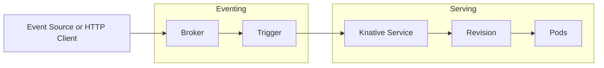

# Knative

Knative adds serverless capabilities on top of Kubernetes by providing a standard way to run container workloads, autoscale them (including scale to zero), and connect them to events.

## Overview

Knative is composed of two main parts:

- **Knative Serving**: Deploys and manages stateless services, handles traffic splitting, and scales based on request volume.
- **Knative Eventing**: Connects event sources to services with brokers, triggers, and subscriptions.

## Basic Architecture

## Why Use Knative

- **Scale to zero** for idle services to reduce cost
- **Traffic management** for safe releases (blue/green, canary)
- **Event-driven** integration without custom glue
- **Kubernetes-native** deployment model

## Common Use Cases

- HTTP APIs with bursty traffic
- Background jobs triggered by events
- Webhooks and integrations
- Rapid prototyping of microservices
