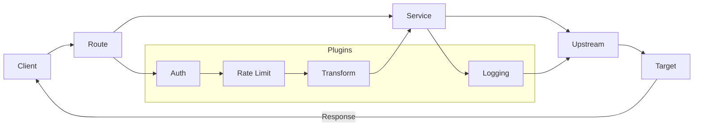
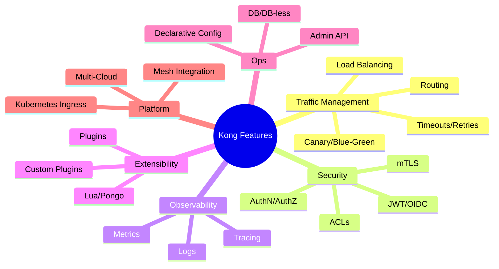

https://developer.konghq.com/gateway/install/

https://konghq.com/blog/engineering/kong-gateway-tutorial

## Kong Request Flow

```mermaid
flowchart LR
		C[Client] --> R[Route]
		R --> S[Service]
		S --> U[Upstream]
		U --> T[Target]
		subgraph Plugins
				P1[Auth]
				P2[Rate Limit]
				P3[Transform]
				P4[Logging]
		end
		R --> P1 --> P2 --> P3 --> S
		S --> P4 --> U
		T -->|Response| C
```

## Kong Features

```mermaid
mindmap
	root((Kong Features))
		Traffic Management
			Routing
			Load Balancing
			Timeouts/Retries
			Canary/Blue-Green
		Security
			AuthN/AuthZ
			mTLS
			JWT/OIDC
			ACLs
		Observability
			Metrics
			Logs
			Tracing
		Extensibility
			Plugins
			Custom Plugins
			Lua/Pongo
		Ops
			Admin API
			Declarative Config
			DB/DB-less
		Platform
			Kubernetes Ingress
			Mesh Integration
			Multi-Cloud
```